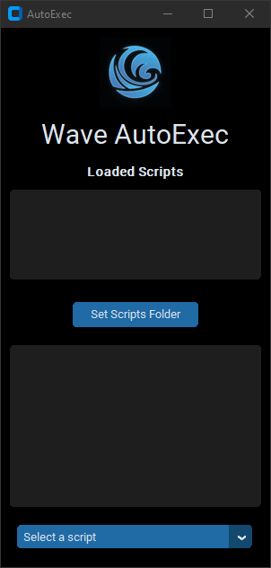

# AutoExec Script Manager

AutoExec is a desktop application built with `customtkinter` that allows users to manage `.luau` scripts for the Wave application. It provides a graphical interface to select and copy scripts to an auto-execution folder with the option to remove them. The application also features automatic detection of script changes and real-time updates to the interface.

<div align="center">
  
</div>

## Features

- **Select Scripts Folder**: Easily set the folder where your `.luau` scripts are located.
- **Script Management**: Use checkboxes to select scripts to copy to the auto-execution folder.
- **Automatic Script Detection**: Detects changes in the scripts folder and updates the interface automatically.
- **Real-time Updates**: The interface updates in real-time to reflect changes in the scripts folder.
- **Interactive Log**: Click the GIF to open a log window for detailed messages.
- **Settings Persistence**: Remembers your last selected folder and script.

## Requirements

- Python 3.x
- [customtkinter](https://github.com/TomSchimansky/CustomTkinter)
- [Pillow](https://python-pillow.org/)
- `tkinter` (usually included with Python)
- [watchdog](https://pypi.org/project/watchdog/)

## Installation

1. **Clone the Repository**:
   ```
   git clone https://github.com/Natsumi-x/autoexec-script-manager.git
   cd autoexec-script-manager
   ```

2. **Install Dependencies**:
   ```
   pip install customtkinter Pillow watchdog
   ```

## Usage

1. **Run the Application**:
   ```
   python autoexec.py
   ```

2. **Select Scripts Folder**: Click "Set Scripts Folder" to choose the directory containing your `.luau` scripts.

3. **Select Scripts**: Use checkboxes to select scripts to copy to the auto-execution folder. The application will automatically detect changes in the scripts folder and update the interface accordingly.

   - **Blue**: Script is in the scripts folder and the autoexec folder.
   - **Purple**: Script is only in the autoexec folder.
   - **White**: Script is only in the scripts folder.

## Building with PyInstaller

1. **Install PyInstaller**:
   ```
   pip install pyinstaller
   ```

2. **Create Executable**:
   ```
   pyinstaller --noconfirm --onefile --windowed --icon "<PATH>\waveautoexec\icon.ico" --add-data "<PATH>\waveautoexec\Assets;Assets/"  "<PATH>\waveautoexec\autoexec.py"
   ```
   Replace `<PATH>` with the path to the folder.

3. **Run the Executable**:
   Navigate to the `output` directory and execute the `AutoExec.exe`.

## Code Overview

### Key Components

- **Script Selection**: Provides checkboxes for selecting scripts.
- **Settings Management**: Saves and loads user settings from a JSON file.
- **File System Monitoring**: Uses the `watchdog` library to monitor changes in the scripts folder and auto-execution folder.

### Functions

- `resource_path(relative_path)`: Manages file paths for development and bundled environments.
- `load_gif(path)`: Loads GIF frames and durations.
- `animate_gif()`: Animates the GIF in the interface.
- `set_scripts_folder()`: Opens a dialog to set the scripts folder.
- `restart_observer()`: Restarts the file system observer.
- `update_option_menu()`: Updates the script selection menu.
- `update_checkbox_color()`: Updates the color of checkboxes based on script status.
- `create_checkbox(script, in_autoexec)`: Creates a checkbox for a script.
- `on_checkbox_toggle(script, checkbox, var)`: Handles script selection and copying.
- `add_script_to_autoexec(script)`: Adds a script to the autoexec folder.
- `remove_script_from_autoexec(script)`: Removes a script from the autoexec folder.
- `update_console(message)`: Updates the log messages.
- `save_settings()`: Saves the current settings to a file.
- `load_settings()`: Loads settings from a file.

## Contribution

Feel free to contribute by opening issues or submitting pull requests. For major changes, please open an issue first to discuss what you would like to change.

## License

This project is licensed under the MIT License.
